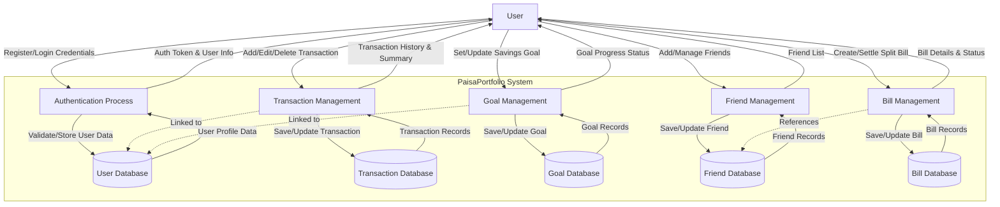

# PaisaPortfolio - Personal Finance Manager

PaisaPortfolio is a modern, feature-rich personal finance management application designed to help users track their income, expenses, savings, and shared bills. Built with the MERN stack (MongoDB, Express.js, React, Node.js), it offers a seamless and responsive user experience with a premium aesthetic.

## 🚀 Features

- **Dashboard**: Get a comprehensive overview of your financial health with visual charts and summaries.
- **Transaction Management**: Easily add, edit, and categorize your income and expenses.
- **Savings Goals**: Set and track progress towards your financial goals.
- **Split Bill**: Manage shared expenses with friends and settle up easily.
- **Dark Mode**: A sleek, eye-friendly dark mode for all screens.
- **Secure Authentication**: User registration and login with JWT authentication.
- **Responsive Design**: Fully responsive interface that works great on desktop and mobile.

## 🛠️ Tech Stack

**Frontend:**
- **React (Vite)**: Fast and modern UI library.
- **Tailwind CSS**: Utility-first CSS framework for styling.
- **Lucide React**: Beautiful & consistent icons.
- **React Router**: For seamless client-side navigation.

**Backend:**
- **Node.js & Express.js**: Robust server-side framework.
- **MongoDB & Mongoose**: NoSQL database for flexible data storage.
- **JWT (JSON Web Tokens)**: For secure user authentication.

## 📋 Prerequisites

Before you begin, ensure you have the following installed:
- [Node.js](https://nodejs.org/) (v14 or higher)
- [MongoDB](https://www.mongodb.com/) (Local or Atlas connection string)

## ⚙️ Installation & Setup

### 1. Clone the Repository

```bash
git clone <repository-url>
cd personal-finance-manage
```

### 2. Backend Setup

Navigate to the backend directory and install dependencies:

```bash
cd backend
npm install
```

Create a `.env` file in the `backend` directory with the following variables:

```env
PORT=5000
MONGO_URI=your_mongodb_connection_string
JWT_SECRET=your_jwt_secret_key
# Add any other specific env vars here
```

Start the backend server:

```bash
npm run dev
```
The server will run on `http://localhost:5000`.

### 3. Frontend Setup

Open a new terminal, navigate to the frontend directory, and install dependencies:

```bash
cd finance-manager
npm install
```

Start the development server:

```bash
npm run dev
```
The application will be available at `http://localhost:5173`.

## 🔌 API Endpoints

The backend provides the following main API routes:

- `/api/auth`: User authentication (register, login).
- `/api/transactions`: Manage income and expense transactions.
- `/api/goals`: Create and track savings goals.
- `/api/bills`: Manage split bills.
- `/api/friends`: Manage friends for bill splitting.
# Data Flow Diagram (DFD) - PaisaPortfolio

This document contains the Level 1 Data Flow Diagram (DFD) for the PaisaPortfolio application, illustrating the flow of data between the user, system processes, and data stores.



## Description

1.  **Authentication Process**: Handles user registration and login. It interacts with the **User Database** to store and verify user credentials.
2.  **Transaction Management**: Manages income and expenses. It stores transaction details in the **Transaction Database** and provides summaries to the user.
3.  **Goal Management**: Allows users to set financial goals. Data is stored in the **Goal Database**.
4.  **Friend Management**: Manages the list of friends for splitting bills. Data is stored in the **Friend Database**.
5.  **Bill Management**: Handles splitting bills among friends. It interacts with the **Bill Database** and references the **Friend Database**.


